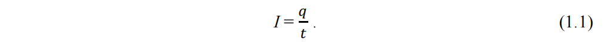
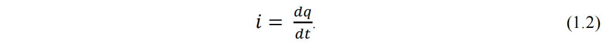

# 1.1 Основні співвідношення

Електричним колом називається система, яка складається з джерел електричної енергії (джерел живлення), приймачів електричної енергії (споживачів) та електричних дротів, які з’єднують їх в єдине ціле, завдяки чому електрична енергія джерела передається споживачу.

В джерелах живлення має місце перетворення в електричну енергію інших видів енергії: механічної – в генераторах, хімічної – в гальванічних елементах і акумуляторах, теплової – в термоелементах, променевої – у фотоелементах і т. ін.

У споживачах відбувається зворотне перетворення електричної енергії в інші види: механічну – в двигунах, теплову – в нагрівальних приладах, світлову – у джерелах світла, хімічну – в різноманітних електрометалургійних та електрохімічних установках.

В процесі перетворення інших видів енергії в електричну у джерелі живлення збуджується електрорушійна сила (ЕРС), завдяки якої в замкненому колі протікає електричний струм. Під дією ЕРС джерела в провідниках виникає електричне поле, на окремих ділянках кола виникає різність електричних потенціалів.

Умовно-позитивним напрямом струму вважають напрямок руху позитивних зарядів. Ділянки кола, які містять ЕРС, називаються активними, а такі, що не містять ЕРС – пасивними.

Величина, або сила електричного струму визначається кількістю електрики (зарядом), що проходить крізь переріз провідника за одиницю часу. Якщо величина і напрямок струму в колі з плином часу не змінюються, його називають постійним струмом `(І)`. Якщо за `t` секунд крізь провідник пройшло `q` одиниць кількості електрики, то сила постійного струму

У найбільш загальному випадку величина і сила струму з плином часу змінюються (змінний струм); значення струму в будь-який момент часу називають миттєвими `(і)`:

Звідси, кількість електрики, яку переносить змінний струм за плин часу від 0 до `t`, дорівнює

В Міжнародній системі одиниць (СІ) основною електричною одиницею вважається одиниця струму ампер (А). Кількість електрики вимірюється в ампер-секундах (А·с), або кулонах (К).

На пасивних ділянках кола позитивні заряди в електричному полі двинуться від точок з вищим потенціалом до точок з меншим потенціалом, тому за позитивний напрямок струму приймається напрямок зниження потенціалу.

Зменшення електричного потенціалу на пасивній ділянці кола, або різність потенціалів на крайніх точках ділянки, називають також електричною напругою, чи просто напругою ділянки кола. Напруга на пасивній ділянці кола є також мірою електричної енергії, яку втрачає джерело енергії на переміщення на цій ділянці заряду в один кулон.

Електрична напруга U між двома точками кола дорівнює роботі, яку має виконати джерело живлення при переміщенні заряду в один кулон з однієї точки кола в іншу:
